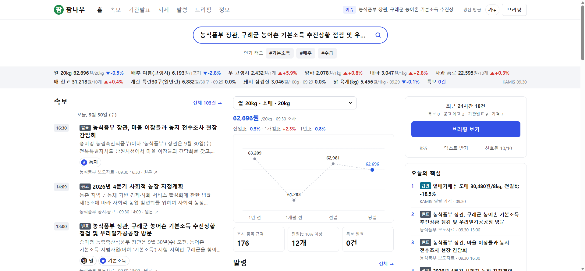

# 팜나우(FarmNow) — 농업 공공데이터 속보

운영 중인 사이트: https://farmnow.tech

농업 공무원(지도사·연구직·정책담당)이 출근 직후 밤사이의 기상특보·가격 급변·공고·입법예고·병해충 발생정보를
시각순 속보로 확인하는 **읽기 전용 정적 사이트**입니다. 시각이 찍힌 짧은 속보, 태그, 한눈 지표바,
규칙으로 뽑는 오늘의 핵심을 농업 공공데이터로 만듭니다.

공무원 개인 시제품이며 기관 공식 서비스가 아닙니다. 공공데이터·공공 API·RSS만 사용하고 로그인·개인정보를 수집하지 않습니다.



## 페이지

| 페이지 | 내용 |
|---|---|
| `index.html` | 최신 속보 20건, 품목 가격 비교 차트, 발령 현황, 최근 24시간 요약, 오늘의 핵심, 급변 Top10 |
| `news.html` | 전체 타임라인(카테고리 탭·검색 `?q=`·태그 `?tag=`) |
| `n-{id}.html` | 속보 상세(발췌·태그·관련 속보·원문 링크) |
| `releases.html` | 보도자료·공고·입법예고·통계 |
| `market.html` | KAMIS 품목별 가격표와 4시점 비교(`?pick=`) |
| `alerts.html` | 발효 중 특보, 특보 통보문, 병해충발생정보·주간농사정보, 공고·입법예고 |
| `brief.html` | 최근 24시간 브리핑(텍스트 복사·TXT/MD 내려받기) |
| `about.html` | 신호원별 이용조건·수집/게시 건수·마지막 성공 시각, 계산식 |
| `feed.xml` | RSS 2.0 |

## 데이터원

| 어댑터 | 원천 | 얻는 것 |
|---|---|---|
| `mafra_rss` | 농식품부 RSS 6종(보도자료·설명자료·입법예고·공지공고·물가정보·통계) + 새 항목의 원문 1회 조회 | 제목, 실제 배포일시, 게시물별 공공누리 유형, 첫 문장 발췌(1·2유형만, 설명자료는 제목만) |
| `kamis` | aT KAMIS `dailySalesList` | 당일·전일·1개월 전·1년 전 조사값, 급변 품목 |
| `nongsaro_list` | 농사로 병해충발생정보·주간농사정보 목록 | 호수·적용 기간·문서 바로보기 링크 |
| `kma_warn` | 기상청 `getWthrWrnMsg`·`getPwnStatus` | 통보문별 해당 구역·발효 시각, 현재 발효 중 특보 |

## 실행

```bash
pip install -r requirements.txt
cp .env.example .env                  # 키를 채운다(없어도 동작)
python -m farmnow.pipeline            # 수집 → data/*.json → site/
python -m http.server -d site 8766    # http://localhost:8766
python -m pytest -q tests
```

| 변수 | 용도 |
|---|---|
| `DATA_GO_KR_KEY` | 공공데이터포털 기상특보 조회서비스 키. 없으면 특보를 건너뛰고 '확인 불가'로 표시 |
| `KAMIS_KEY`, `KAMIS_ID` | KAMIS 오픈API. 없으면 공개 테스트키 사용 |
| `SITE_BASE_URL` | 배포 주소(RSS 채널 링크용). 비우면 `config/sources.yml`의 `base_url` |

첫 실행은 RSS 여러 쪽과 원문을 조회하느라 2~3분 걸리고, 이후 실행은 새 항목만 조회합니다.
`data/items.json`이 실행 사이에 이어져야 14일 타임라인이 유지됩니다.

## 서버 배포

정적 파일이라 웹서버 하나와 예약 작업이면 됩니다. `deploy/`에 예시가 있습니다.

- `deploy/update.sh` — 수집·빌드 1회 실행(중복 실행 방지, 기록은 `logs/update.log`). cron 예: `*/30 * * * * /srv/farmnow/deploy/update.sh`
- `deploy/Caddyfile.farmnow` — Caddy 사이트 블록 예시
- `deploy/root-setup.sh` — 디렉터리 생성과 Caddy 반영을 한 번에 하는 스크립트(root로 1회)
- 서버에 pip가 없으면 `pip install --target vendor beautifulsoup4 feedparser`로 받은 `vendor/`를 함께 올립니다(`update.sh`가 `PYTHONPATH`에 추가).

## 규칙

- 라벨·심각도·만료는 발령 등급·게시판 종류·변동률 임계값에서 규칙으로만 생성
- 본문 발췌는 공공누리 1·2유형·제한 없음일 때만, 그 밖에는 제목·링크만 게시
- 문장이 끊기거나 따옴표가 닫히지 않는 발췌, 담당자·연락처가 든 줄은 쓰지 않음. 담당자명은 저장하지 않음
- 자동 생성 문장에 전망·권유 표현이 있으면 게시 거부, 기상 정보는 통보문의 구역만 인용
- 오늘의 핵심에서 해제된 특보는 제외, 발효 건수는 기상청 현황 통보문 기준(갱신 실패 시 '확인 불가')
- 원문을 확인하지 못했거나 배포 예정 시각이 아직 오지 않은 보도자료는 게시하지 않고 다음 실행에서 다시 확인
- 모든 신호원이 실패하면 빌드를 중단해 이전 사이트를 유지

## 구조

```
config/sources.yml   신호원·이용조건·지표바 품목      config/dicts.yml   태그 사전(품목·사건·지역·제외어)
farmnow/collectors   어댑터(1신호원 1모듈)            farmnow/rules.py   태그·오늘의 핵심·특보 상태·요약
farmnow/model.py     NewsItem·게시 게이트             farmnow/build.py   Jinja2 정적 빌드
templates/           base + 8쪽 + 상세 + feed/brief   tests/             규칙·파서·빌드 테스트
deploy/              갱신 스크립트·Caddy 예시
```

다른 분야로 바꾸려면 `config/`와 `collectors/`만 고치면 됩니다.

## 데이터 이용조건

각 원천의 이용조건을 따릅니다. 농식품부 게시물은 게시물마다 표시된 공공누리 유형을 읽어 적용하고,
기상청 API는 공공누리 1유형, 농사로 문서는 목록 정보와 원문 링크만 사용합니다.
KAMIS 조사값의 게시 범위는 운영키 약관 확인 전까지 `license: unknown`으로 둡니다.

## 라이선스

코드는 MIT License([LICENSE](LICENSE)). 수집되는 데이터는 위 이용조건을 따릅니다.
